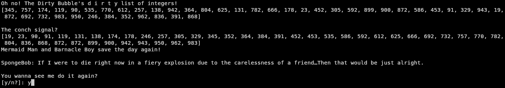

# dirty-bubble-sort

Dirty Bubble Sort is a CLI Python script designed to generate a random list of integers, sort that list "dirty bubble" style, and print out a random SpongeBob SquarePants quote.

And now, for your reading pleasure, a few select excerpts from Mermaid Man and Barnacle Boy episode transcripts...

"SpongeBob: Hey, Mermaid Man. **approaches Mermaid Man and Barnacle Boy's table**
Mermaid Man: Uh, he--here comes the TV repairman.
Barnacle Boy: What do you want from us?
SpongeBob: Hold on. Just let me look at ya.
Mermaid Man: Stay alert, Barnacle Boy. He...he's up to something.
Barnacle Boy: Will you cut...will you stop calling me 'boy'?
SpongeBob: Do you remember the time the food supply in Atlantis was running low? So you invented a ray gun that make things grow six times their size to shoot at the kelp gardens. But then, **changes the shape of his head to look more rounded** the evil Man Ray swoops down and swipes the gun away and shoots all the algae! **mimes firing the gun** And he gloms onto the undersea dome! **jumps and lands mouth-first onto a table, where Incidental 88 is eating oatmeal, causing the container filled with juice to go airborne** And he starts sucking on the glass. **sucks on the table. Incidental 88 moves his oatmeal away from SpongeBob in disgust**" - Season 1, episode 6a: _Mermaid Man and Barnacle Boy_

"Dirty Bubble: **laughs evilly** Still getting burned on that tail pipe, huh, Barnacle Boy? **laughs evilly**
Barnacle Boy: It's the Dirty Bubble!
Mermaid Man: In all his dirty roundness! **screams as the Dirty Bubble continues to laugh evilly**
Barnacle Boy: Oh, no!" - Season 1, episode 20b: _Mermaid Man and Barnacle Boy II_

"Man Ray: **holds it out to Patrick** Excuse me, sir! But I do believe you've dropped your wallet.
Patrick: Doesn't look familiar to me.
Man Ray: What? I just saw you drop it. Here.
Patrick: Nope, it's not mine.
Man Ray: It is yours. I... am trying to be a good person and return it to you.
Patrick: Return what to who?
Man Ray: **facepalms, then shows Patrick his own ID** Aren't you Patrick Star?
Patrick: Yup.
Man Ray: And this is your ID.
Patrick: Yup.
Man Ray: I found this ID in this wallet. And if that's the case, this must be your wallet.
Patrick: That makes sense to me.
Man Ray: Then take it.
Patrick: It's not my wallet." - Season 2, episode 31a: _Mermaid Man and Barnacle Boy III_

"Patrick: Let me take a look at it. Hmmm. You know what the problem is?
SpongeBob: What?
Patrick: You got it set to **points to the M** 'M' for Mini when it should be set to **turns M around** 'W' for Wumbo.
SpongeBob: Patrick, I don't think 'Wumbo' is a real word.
Patrick: Come on! You know... I wumbo, You wumbo, He, she, me... wumbo! Wumbo, wumboing... **he rambles on**
Squidward: **while Patrick is saying 'we'll have the wumbo'** I wonder if the fall from this height would be enough to kill me?
Patrick: **continues** ...we'll have the wumbo, Wumborama... Wumbology, the study of wumbo? It's first grade, SpongeBob" - Season 3, episode 45a: _Mermaid Man and Barnacle Boy IV_

"John and Nancy: Stop, please!
E.V.I.L.: John and Nancy, sitting in a tree, K-I-S-S-I-N-G!
Dirty Bubble: Oh! **points at a car** Shine the flashlight in that car, Man Ray!
Man Ray: Haha, with pleasure! **shines the light on Sandals making out with a pillow**
Sandals: Hey man, that's not cool." - Season 3, episode 52b: _Mermaid Man and Barnacle Boy V_
